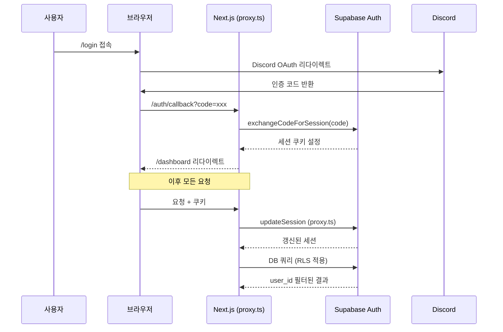
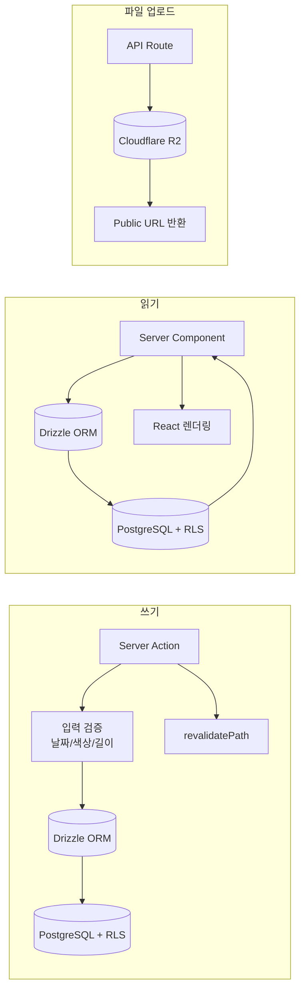
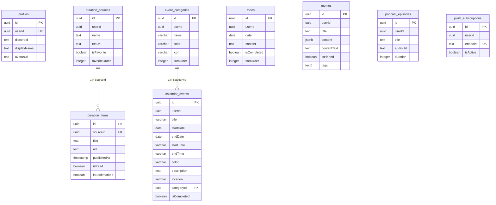

# forme - 아키텍처 & 기술 선정 이유

> 최종 업데이트: 2026-03-08 (SW network-first 전환 + Cron 보안 강화 + UUID 검증 통일)

개인 올인원 PWA. 큐레이션(RSS), 캘린더, 메모(리치 에디터), 팟캐스트를 하나의 앱에 통합.
모바일 퍼스트, 오프라인 지원, 푸시 알림까지 네이티브 앱 수준의 경험을 웹으로 제공.

---

## 아키텍처 개요

```mermaid
graph TB
  subgraph Browser["Browser (PWA)"]
    SW[Service Worker<br/>푸시 + 캐시]
    RC[React 19<br/>Server Components]
    TE[TipTap Editor<br/>메모 리치 에디터]
    DK[@dnd-kit<br/>드래그 정렬]
  end

  subgraph Vercel["Vercel Edge (icn1 서울)"]
    NJ[Next.js 16<br/>App Router + Proxy]
    SA[Server Actions<br/>CRUD + 검증 + traceAction]
    API[API Routes<br/>withTracing 래퍼]
    AUTH[lib/auth.ts<br/>React.cache 인증]
    LOG[lib/logger.ts<br/>구조화 로깅]
  end

  subgraph External["External Services"]
    SB[(Supabase<br/>Auth + PostgreSQL + RLS)]
    R2[(Cloudflare R2<br/>오디오 + 이미지)]
    RSS[RSS Feeds<br/>큐레이션 소스]
    DC[Discord OAuth]
  end

  RC -->|Server Actions| SA
  RC -->|fetch| API
  SA -->|Drizzle ORM| SB
  SA --> AUTH
  API --> LOG
  API -->|S3 SDK| R2
  API -->|feedsmith| RSS
  NJ -->|세션 갱신| SB
  DC -->|OAuth 콜백| SB
  SW -->|web-push| API
```

**핵심 원칙**: Server Components 우선, RLS로 데이터 격리, 서버 측 입력 검증 필수 (`lib/validators.ts` 공유 정규식), 최소한의 클라이언트 상태, 무거운 컴포넌트 지연 로딩, 인터랙션 optimistic updates, 반응형 레이아웃 (모바일 단일컬럼 ↔ 데스크톱 멀티컬럼), Vercel 리전과 DB 리전 코로케이션 (서울). Safari PWA 호환성 우선 (`flex flex-col` Dialog, `overscroll-behavior` 조건부 해제).

---

## 기술 스택 선정 이유

### 프레임워크: Next.js 16 + React 19

**왜 Next.js 16인가**: App Router의 Server Components로 클라이언트 번들 최소화. `proxy.ts`(Next.js 16 방식)로 인증 세션 자동 갱신. Server Actions로 API 레이어 없이 DB 직접 조작.

| 탈락 후보 | 이유 |
|-----------|------|
| Remix | Supabase SSR 통합이 Next.js에 최적화 |
| Vite + React | SSR/ISR 없음, 별도 백엔드 필요 |
| SvelteKit | 에코시스템 (shadcn/ui, TipTap 등) 부족 |

### DB & Auth: Supabase (Auth + PostgreSQL + RLS)

**왜 Supabase인가**: Discord OAuth 내장, RLS로 코드 레벨 권한 체크 불필요 (`auth.uid() = user_id`). PostgreSQL의 JSONB로 TipTap 문서 저장. 무료 티어로 개인 프로젝트에 적합.

| 탈락 후보 | 이유 |
|-----------|------|
| Firebase | PostgreSQL 대비 복잡한 쿼리 제한, JSONB 없음 |
| PlanetScale | Auth 별도 구축 필요, RLS 없음 |
| Neon + NextAuth | 두 서비스 관리 부담 |

### ORM: Drizzle ORM

**왜 Drizzle인가**: TypeScript 타입 안전성, SQL에 가까운 쿼리 빌더, 가벼운 번들 사이즈. `packages/shared`에서 스키마 정의 → 웹에서 import.

| 탈락 후보 | 이유 |
|-----------|------|
| Prisma | 번들 사이즈 과다 (Edge 배포 제약), 런타임 무거움 |
| Supabase JS SDK 직접 | 타입 안전성 부족, 복잡한 조인 어려움 |
| Kysely | Drizzle 대비 마이그레이션 도구 미흡 |

### 스토리지: Cloudflare R2

**왜 R2인가**: S3 호환 API (기존 SDK 재사용), egress 무료, 팟캐스트 오디오(200MB) + 메모 이미지(5MB) 저장에 비용 효율적.

| 탈락 후보 | 이유 |
|-----------|------|
| Supabase Storage | 200MB 업로드 제한 이슈 |
| AWS S3 | egress 비용 |
| Vercel Blob | 비용 예측 어려움 |

### 에디터: TipTap (ProseMirror 기반)

**왜 TipTap인가**: ProseMirror 기반으로 확장성 뛰어남. JSONB로 직렬화 → DB 저장/검색 용이. React NodeView로 커스텀 블록(이미지, 코드블록) 구현 가능.

| 탈락 후보 | 이유 |
|-----------|------|
| Lexical (Meta) | TipTap 대비 에코시스템/플러그인 부족 |
| Slate | API 불안정, 마이그레이션 잦음 |
| Quill | 커스텀 블록 확장 어려움 |

### 스타일링: Tailwind CSS 4 + shadcn/ui

**왜 이 조합인가**: Tailwind 4의 CSS 변수 기반 테마로 다크모드 용이. shadcn/ui는 복사 기반이라 커스터마이징 자유도 높음. Radix UI 접근성 내장.

---

## 인증/인가 흐름



**방어 레이어**:
- **open redirect 방어**: 콜백 시 `ALLOWED_PATHS` 화이트리스트 검증
- **RLS**: 모든 테이블에 `auth.uid() = user_id` 정책
- **CSP**: `script-src 'self' 'unsafe-inline'`, 외부 도메인 제한
- **HSTS + Permissions-Policy**: 보안 헤더 적용

---

## 데이터 흐름



**패턴 요약**:
- **읽기**: Server Component → Drizzle → RLS 적용된 결과 직접 렌더
- **쓰기**: Server Action → 서버 측 검증 → Drizzle insert/update → revalidatePath
- **업로드**: API Route → FormData → R2 업로드 (Cache-Control 포함) → URL 반환
- **크롤링**: Cron/SSE → feedsmith 파싱 → SSRF 방어 → DB 적재
- **인증**: `React.cache` 기반 `getAuthUser()` — 동일 요청 내 중복 인증 제거
- **캘린더**: Optimistic updates — 로컬 상태 즉시 반영, 서버 백그라운드 동기화. 데스크톱 2컬럼 (`lg:flex-row` 캘린더 | 상세), 모바일 단일 컬럼. 이벤트 카테고리(아이콘+색상) 지원

---

## DB 스키마



**10개 테이블**, 모든 테이블에 `userId` + RLS. `memos.content`는 TipTap JSON (JSONB), `contentText`는 검색용 평문 인덱스.

---

## API 라우트

| Method | Endpoint | 설명 |
|--------|----------|------|
| GET | `/api/curation` | 큐레이션 아이템 목록 (커서 페이지네이션) |
| POST | `/api/curation/crawl` | SSE 수동 크롤 |
| POST | `/api/curation/sources/reorder` | 즐겨찾기 순서 배치 업데이트 |
| GET | `/api/cron/curation` | Cron 자동 크롤 + 푸시 (timingSafeEqual 인증) |
| POST | `/api/memo/image` | 메모 이미지 R2 업로드 (5MB) |
| POST | `/api/podcast/upload` | 팟캐스트 오디오 R2 업로드 (200MB) |
| GET/POST/DELETE | `/api/push/subscribe` | 푸시 구독 관리 |

---

## 보안

| 레이어 | 방어 |
|--------|------|
| 인증 | Discord OAuth + Supabase Auth |
| 인가 | PostgreSQL RLS (`auth.uid() = user_id`) |
| 입력 검증 | `lib/validators.ts` 공유 정규식 + Server Action/API에서 날짜, 색상, URL, 길이, UUID 형식 검증. 인라인 정규식 금지 |
| UUID 검증 | 모든 CRUD 함수의 id 파라미터에 UUID_REGEX 적용 (calendar, todos, memos, categories, curation, podcast) |
| API 핸들러 순서 | 인증(auth) → 입력 검증(UUID 등) → 비즈니스 로직 (인증 전 입력 검증 금지) |
| Cron 인증 | `timingSafeEqual`로 CRON_SECRET 비교 (타이밍 공격 방어), 응답에 내부 상세 미노출 |
| 네트워크 | SSRF 방어 (`isSafeUrl` — IPv4/IPv6 사설, IPv4-mapped IPv6, ULA, Link-Local 차단), HTTPS 강제 |
| 헤더 | CSP, HSTS, X-Frame-Options, Permissions-Policy |
| 리다이렉트 | `ALLOWED_PATHS` 화이트리스트 |
| 업로드 | MIME 검증, 크기 제한, 안전한 키 생성 |
| 푸시 | HTTPS endpoint 강제, 소유자 확인 |

---

## Safari PWA 호환성

| 문제 | 원인 | 해결 |
|------|------|------|
| Dialog 내부 스크롤 불가 | `overscroll-behavior-y: contain`이 Safari에서 fixed 자식 스크롤까지 차단 | `body[data-scroll-locked]`에서 `overscroll-behavior-y: auto` 해제 |
| Dialog 콘텐츠 클리핑 | Safari에서 `display: grid` + `overflow-y: auto` 조합이 스크롤 대신 클리핑 | `dialog.tsx` 기본 레이아웃을 `flex flex-col`로 변경 |
| Dialog 수직 센터링 + 스크롤 충돌 | `top-50% translate-y-[-50%]` transform이 Safari overflow와 충돌 | `inset-y-0 my-auto`로 transform 없는 센터링 |
| Pull-to-Refresh HMR 에러 | lucide-react import가 Turbopack 모듈 팩토리와 충돌 | 인라인 SVG로 외부 의존성 제거 |
| Pull-to-Refresh 시 데이터 미갱신 | `router.refresh()`가 서버 컴포넌트만 리페치 | `window.location.reload()`로 전체 새로고침 |

상세: `docs/26-03-08-safari-dialog-scroll-fix.md`

---

## 성능 최적화

### 인프라 최적화

| 전략 | 설정 | 효과 |
|------|------|------|
| Vercel 리전 코로케이션 | `vercel.json` → `"regions": ["icn1"]` | DB 왕복 180ms → ~5ms |
| DB 커넥션 풀 최적화 | `max: 1` (Supabase Transaction Pooler 위임) | 서버리스 커넥션 고갈 방지 |
| 서버 전용 패키지 분리 | `serverExternalPackages: ['@aws-sdk/*', 'web-push']` | 클라이언트 번들에서 ~2MB 제외 |
| 이미지 최적화 | `formats: ['image/avif', 'image/webp']`, `minimumCacheTTL: 86400` | 이미지 30-50% 압축 + 24h 캐시 |

### 번들 최적화

| 전략 | 대상 | 효과 |
|------|------|------|
| `next/dynamic` + `ssr: false` | TipTap 에디터, DnD Kit, EventForm, CategoryManager | 초기 번들 -1.5MB+ |
| lowlight 선택적 등록 | 170+언어 → 12언어 (js/ts/py/css/html/json/bash/sql/md/yaml/java/go) | TipTap 청크 ~360KB 절감 |
| LayoutShell 분리 | PlayerProvider → MiniPlayer만 래핑 | 서버 컴포넌트 활용 극대화 |
| Dashboard Suspense | 위젯 3개 병렬 스트리밍 | 순차 → 병렬 로딩 |
| DashboardCuration 서버화 | 클라이언트 → 서버 컴포넌트 전환 | 클라이언트 JS 제거 |
| 대형 컴포넌트 분리 | source-manager(696→451), memo-editor(536→398), event-form(566→527), curation-feed(490→419) | 유지보수성 + 번들 tree-shaking 개선 |
| `useAutoSave` 훅 추출 | 자동저장 로직 → saveFnRef 패턴, Promise 동시저장 방어 | 이벤트 리스너 재등록 최소화 |
| `@next/bundle-analyzer` | `ANALYZE=true pnpm build`로 번들 프로파일링 | 번들 사이즈 분석 가능 |

### 렌더링 최적화

| 전략 | 대상 | 효과 |
|------|------|------|
| PlayerContext 분리 | `usePlayer()` (상태) + `usePlayerTime()` (시간) | 4Hz 전체 리렌더 → 시간 UI만 |
| `React.memo` | CurationCard, CurationListRow | 필터 변경 시 무관한 카드 리렌더 방지 |
| `useCallback` | CalendarClient 핸들러 (handleSelectDate 등) | WeekRow React.memo 정상 작동 |
| 중복 Auth 제거 | Dashboard 컴포넌트 → `getAuthUser()` 통일 | 요청당 auth 3회 → 1회 |
| 쿼리 병렬화 | DashboardCalendar todos + events → `Promise.all` | 순차 → 동시 실행 |
| Reorder API 병렬화 | N개 순차 UPDATE → `Promise.all` | 50개 기준 10초 → ~5ms |

### 캐싱 전략

| 계층 | 전략 | 세부 |
|------|------|------|
| Service Worker | cache-first + LRU | `/_next/static/` (max 100), 폰트, 아이콘, 오디오 (max 50) |
| Service Worker | network-first (4초 타임아웃) | HTML / RSC 페이지 (오프라인 시 캐시 폴백) |
| Service Worker | network-first | `/api/curation`, `/api/push` |
| R2 업로드 | `Cache-Control` 헤더 | 오디오 30일 immutable, 이미지 7일 |
| 인증 | `React.cache` | 요청당 `getUser()` 1회 |
| Header 아바타 | `sessionStorage` | 세션당 `/api/profile` 1회 |

### DB 인덱싱

| 테이블 | 인덱스 | 쿼리 패턴 |
|--------|--------|-----------|
| `calendar_events` | `(userId, startDate, endDate)` 복합 | 월간 이벤트 조회 |
| `todos` | `(userId, date)` 복합 | 날짜별 투두 조회 |
| `todos` | `(userId, isCompleted, date)` 복합 | 투두 스트릭 계산 (GROUP BY + HAVING) |
| `event_categories` | `(userId, sortOrder)` 복합 | 사용자별 카테고리 정렬 조회 |
| `curation_items` | `(sourceId, url)` unique | 중복 방지 |
| `curation_items` | `(sourceId, isRead, isBookmarked, category)` 복합 | 다중 필터 쿼리 최적화 |
| `user_daily_activity` | `(userId, date)` 복합 | 스트릭 계산 날짜 정렬 |
| `memos` | `tags` GIN | 태그 배열 검색 |

### 트레이싱

- **API Routes**: `withTracing()` 래퍼 — 요청/응답 시간, 느린 요청(>1s) 자동 경고
- **Server Actions**: `traceAction()` — 전체 액션 시간 측정
- **DB Queries**: `traceQuery()` — 개별 쿼리 시간 측정 (>200ms 경고)

---

## 테스트

- **프레임워크**: Vitest 4 + @testing-library/react
- **패턴**: `vi.hoisted()` Proxy 기반 DB 목 (`packages/web/src/__tests__/`)
- **E2E**: Playwright 1.58 (설치됨, 테스트 작성 예정)

---

## 핵심 의존성 버전

| 패키지 | 버전 | 용도 |
|--------|------|------|
| next | 16.1.6 | 프레임워크 |
| react | 19.1.0 | UI |
| @supabase/supabase-js | 2.97.0 | Auth + DB 클라이언트 |
| drizzle-orm | 0.33.0 | ORM |
| @tiptap/core | 3.20.0 | 리치 텍스트 에디터 |
| lowlight | 3.3.0 | 코드블록 구문 하이라이팅 |
| tailwindcss | 4.2.1 | 스타일링 |
| @aws-sdk/client-s3 | 3.1000.0 | R2 업로드 |
| web-push | 3.6.7 | 푸시 알림 |
| feedsmith | 2.9.0 | RSS 파싱 |
| @dnd-kit/core | 6.3.1 | 드래그앤드롭 |
| @next/bundle-analyzer | 16.1.6 | 번들 분석 |
| typescript | 5.9.3 | 타입 체크 |
| node | >=22.0.0 | 런타임 |
| pnpm | >=9.0.0 | 패키지 매니저 |
