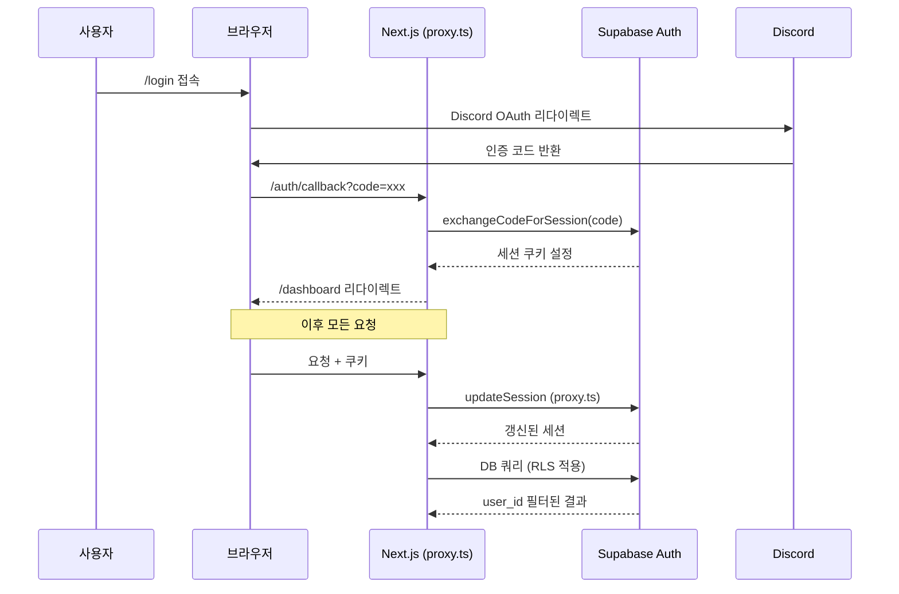
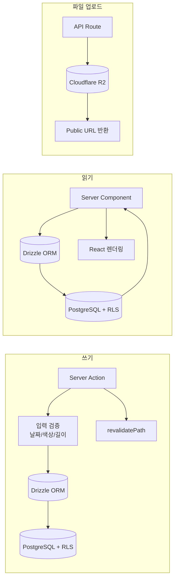
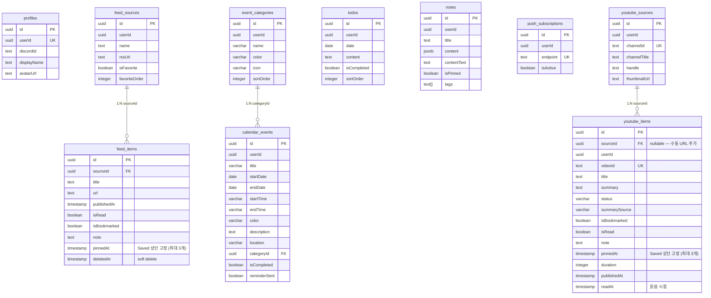

# forme - 아키텍처 & 기술 선정 이유

> 최종 업데이트: 2026-04-20 (큐레이션 → 피드 전면 리네임, 팟캐스트 제거)

개인 올인원 PWA. 피드(RSS), 캘린더, 노트(리치 에디터), 유튜브 요약을 하나의 앱에 통합.
모바일 퍼스트, 오프라인 지원, 푸시 알림까지 네이티브 앱 수준의 경험을 웹으로 제공.

---

## 아키텍처 개요

```mermaid
graph TB
  subgraph Browser["Browser (PWA)"]
    SW[Service Worker<br/>푸시 + 캐시]
    RC[React 19<br/>Server Components]
    TE[TipTap Editor<br/>노트 리치 에디터]
    DK[@dnd-kit<br/>드래그 정렬]
  end

  subgraph Vercel["Vercel Edge (icn1 서울)"]
    NJ[Next.js 16<br/>App Router + Proxy]
    SA[Server Actions<br/>CRUD + 검증 + traceAction]
    API[API Routes<br/>withTracing 래퍼]
    AUTH[lib/auth.ts<br/>React.cache 인증]
    LOG[lib/logger.ts<br/>구조화 로깅]
  end

  subgraph Cron["Scheduled Jobs"]
    CR1[Vercel Cron<br/>feed 크롤 22시]
    CR2[Vercel Cron<br/>calendar-daily 08시]
    CR3[Supabase pg_cron<br/>calendar-reminder 5분]
  end

  subgraph External["External Services"]
    SB[(Supabase<br/>Auth + PostgreSQL + RLS)]
    R2[(Cloudflare R2<br/>이미지)]
    RSS[RSS Feeds<br/>피드 소스]
    DC[Discord OAuth]
    GM[Gemini 2.5 Flash<br/>영상 요약 AI<br/>GEMINI_MODEL 환경변수]
    YT[YouTube<br/>RSS + Innertube ANDROID 자막 + Data API v3]
  end

  RC -->|Server Actions| SA
  RC -->|fetch| API
  SA -->|Drizzle ORM| SB
  SA --> AUTH
  API --> LOG
  API -->|S3 SDK| R2
  API -->|feedsmith| RSS
  NJ -->|세션 갱신| SB
  DC -->|OAuth 콜백| SB
  SW -->|web-push| API
  CR1 -->|verifyCronSecret| API
  CR2 -->|verifyCronSecret| API
  CR3 -->|verifyCronSecret| API
  API -->|자막 추출| YT
  API -->|JSON 모드 요약| GM
```

**핵심 원칙**: Server Components 우선, RLS로 데이터 격리, 서버 측 입력 검증 필수 (`lib/validators.ts` 공유 정규식), 최소한의 클라이언트 상태, 무거운 컴포넌트 지연 로딩, 인터랙션 optimistic updates, 반응형 레이아웃 (모바일 단일컬럼 ↔ 데스크톱 멀티컬럼), Vercel 리전과 DB 리전 코로케이션 (서울). Safari PWA 호환성 우선 (`flex flex-col` Dialog, `overscroll-behavior` 조건부 해제). 대형 컴포넌트 → 커스텀 훅/하위 컴포넌트 추출 (useCalendarState, useEditorConfig, DayCell, lane-utils 등). WCAG 2.1 AA 접근성 준수 (터치 타겟 44px, focus-visible, aria-live, prefers-reduced-motion).

---

## 기술 스택 선정 이유

### 프레임워크: Next.js 16 + React 19

**왜 Next.js 16인가**: App Router의 Server Components로 클라이언트 번들 최소화. `proxy.ts`(Next.js 16 방식)로 인증 세션 자동 갱신. Server Actions로 API 레이어 없이 DB 직접 조작.

| 탈락 후보 | 이유 |
|-----------|------|
| Remix | Supabase SSR 통합이 Next.js에 최적화 |
| Vite + React | SSR/ISR 없음, 별도 백엔드 필요 |
| SvelteKit | 에코시스템 (shadcn/ui, TipTap 등) 부족 |

### DB & Auth: Supabase (Auth + PostgreSQL + RLS)

**왜 Supabase인가**: Discord OAuth 내장, RLS로 코드 레벨 권한 체크 불필요 (`auth.uid() = user_id`). PostgreSQL의 JSONB로 TipTap 문서 저장. 무료 티어로 개인 프로젝트에 적합.

| 탈락 후보 | 이유 |
|-----------|------|
| Firebase | PostgreSQL 대비 복잡한 쿼리 제한, JSONB 없음 |
| PlanetScale | Auth 별도 구축 필요, RLS 없음 |
| Neon + NextAuth | 두 서비스 관리 부담 |

### ORM: Drizzle ORM

**왜 Drizzle인가**: TypeScript 타입 안전성, SQL에 가까운 쿼리 빌더, 가벼운 번들 사이즈. `packages/shared`에서 스키마 정의 → 웹에서 import.

| 탈락 후보 | 이유 |
|-----------|------|
| Prisma | 번들 사이즈 과다 (Edge 배포 제약), 런타임 무거움 |
| Supabase JS SDK 직접 | 타입 안전성 부족, 복잡한 조인 어려움 |
| Kysely | Drizzle 대비 마이그레이션 도구 미흡 |

### 스토리지: Cloudflare R2

**왜 R2인가**: S3 호환 API (기존 SDK 재사용), egress 무료, 팟캐스트 오디오(200MB) + 노트 이미지(5MB) 저장에 비용 효율적.

| 탈락 후보 | 이유 |
|-----------|------|
| Supabase Storage | 200MB 업로드 제한 이슈 |
| AWS S3 | egress 비용 |
| Vercel Blob | 비용 예측 어려움 |

### 에디터: TipTap (ProseMirror 기반)

**왜 TipTap인가**: ProseMirror 기반으로 확장성 뛰어남. JSONB로 직렬화 → DB 저장/검색 용이. React NodeView로 커스텀 블록(이미지, 코드블록) 구현 가능.

| 탈락 후보 | 이유 |
|-----------|------|
| Lexical (Meta) | TipTap 대비 에코시스템/플러그인 부족 |
| Slate | API 불안정, 마이그레이션 잦음 |
| Quill | 커스텀 블록 확장 어려움 |

### 스타일링: Tailwind CSS 4 + shadcn/ui

**왜 이 조합인가**: Tailwind 4의 CSS 변수 기반 테마로 다크모드 용이. shadcn/ui는 복사 기반이라 커스터마이징 자유도 높음. Radix UI 접근성 내장.

---

## 인증/인가 흐름



**방어 레이어**:
- **open redirect 방어**: 콜백 시 `ALLOWED_PATHS` 화이트리스트 검증
- **RLS**: 모든 테이블에 `auth.uid() = user_id` 정책
- **CSP**: `script-src 'self' 'unsafe-inline'`, 외부 도메인 제한
- **HSTS + Permissions-Policy**: 보안 헤더 적용

---

## 데이터 흐름



**패턴 요약**:
- **읽기**: Server Component → Drizzle → RLS 적용된 결과 직접 렌더
- **쓰기**: Server Action → 서버 측 검증 → Drizzle insert/update → revalidatePath
- **업로드**: API Route → FormData → R2 업로드 (Cache-Control 포함) → URL 반환
- **크롤링**: Cron/SSE → feedsmith 파싱 → SSRF 방어 → DB 적재
- **인증**: `React.cache` 기반 `getAuthUser()` — 동일 요청 내 중복 인증 제거
- **캘린더**: Optimistic updates — 로컬 상태 즉시 반영, 서버 백그라운드 동기화. 데스크톱 2컬럼 (`lg:flex-row` 캘린더 | 상세), 모바일 단일 컬럼. 이벤트 카테고리(아이콘+색상) 지원
- **피드 UX**: 키보드 네비 (j/k/o/b, DOM 직접 포커스링), 선택 모드 (일괄 삭제 100개 청크 + 읽음 탭 안읽음 되돌리기, bulk-action API, aria-live 카운트, itemsRef 패턴), 인라인 노트 (읽음+북마크 탭, `ITEM_NOTE_MAX_LENGTH=1000`, key prop 동기화), Saved 핀 고정 (최대 3개, 서버 검증 + 409, 마소너리 뷰)
- **유튜브 요약**: 수집과 요약 분리 — RSS로 무료 수집 (videoId 중복 스킵, YouTube Data API v3로 duration 조회 → Shorts/2분 미만 필터) → 선택적 Gemini 요약 (GEMINI_MODEL 환경변수, 영상 길이별 동적 프롬프트, 자막 최대 80K자, Innertube ANDROID client로 자막 추출 (POT 불필요, WEB client는 빈 응답) → description 폴백, summarySource 플래그). URL 직접 추가 (AddUrlDialog → SSE 원스텝 요약, 트랜잭션 delete+insert, cancel 시 orphan 정리). SSE 스트리밍 요약 (api/feed/crawl 패턴), 마크다운 렌더러 `next/dynamic` 지연 로딩, Saved 핀 고정 (최대 3개, 마소너리 뷰), optimistic updates + 에러 롤백, 자막 URL SSRF 방어, 읽음 탭 readAt DESC 정렬, 피드 선택 모드 (일괄 삭제/안읽음 되돌리기), 즐겨찾기 소스 DnD 순서변경
- **크롤링 중복 방지**: 크로스소스 제목 dedup — 동일 유저의 기존 아이템 제목과 비교 후 중복 스킵 (feedSources join, 100개 청크 조회)
- **에러 처리**: 모든 (main) 페이지 error.tsx (calendar, feed, memo, video) — `error` prop 로깅, 사용자에게 제네릭 메시지만 표출
- **접근성**: 탭바 `aria-current="page"`, 검색 `aria-label`, 이벤트 폼 색상 `focus-visible:ring-2` + `aria-label`, 폼 라벨 `htmlFor`/`id` 연결, 에러 메시지 `role="alert" aria-live="polite"`, 터치 타겟 최소 44x44px, `@utility focus-ring` CSS 유틸리티, `prefers-reduced-motion` 미디어 쿼리, progressbar ARIA 속성, 장식 아이콘 `aria-hidden="true"` (라벨 있는 버튼 내부 lucide 아이콘)
- **상태 관리 패턴**: 대형 컴포넌트 상태 → 커스텀 훅 추출 (`useCalendarState` 14개 상태, `useEditorConfig` TipTap 확장), `saveFnRef` 패턴으로 stale closure 방지 (player-context, use-auto-save), `useReducer`로 복잡한 상태 관리 (upload-dialog)
- **공유 유틸**: `lib/format-time.ts` (formatTime, formatDuration), `lib/constants.ts` (앱 전역 상수), `components/ui/list-skeleton.tsx` (목록 스켈레톤)

---

## DB 스키마



**10개 테이블**, 모든 테이블에 `userId` + RLS. `notes.content`는 TipTap JSON (JSONB), `contentText`는 검색용 평문 인덱스. `pinned_at` (feed_items / youtube_items)는 Saved 뷰 상단 고정 (최대 3개, API 레이어 서버 검증).

---

## API 라우트

| Method | Endpoint | 설명 |
|--------|----------|------|
| GET | `/api/feed` | 피드 아이템 목록 (커서 페이지네이션, memo 포함) |
| PATCH | `/api/feed/[id]` | 아이템 읽음/북마크/노트/pinned 업데이트 (ownership join 검증, 핀 최대 3개 서버 체크 → 409) |
| DELETE | `/api/feed/[id]` | 아이템 단건 삭제 (ownership join 검증) |
| POST | `/api/feed/bulk-delete` | 아이템 일괄 삭제 (max 100, UUID 전수 검증) |
| POST | `/api/feed/bulk-action` | 일괄 액션 (mark_unread/delete, max 100개, ownership join 검증) |
| POST | `/api/feed/crawl` | SSE 수동 크롤 |
| POST | `/api/feed/sources/reorder` | 즐겨찾기 순서 배치 업데이트 |
| GET | `/api/cron/feed` | Cron 자동 크롤 + 푸시 (verifyCronSecret 멀티유저 인증, 제목 dedup) |
| GET | `/api/cron/calendar-daily` | 08시 KST 데일리 요약 푸시 (멀티유저, 일정+투두 카운트) |
| GET/POST | `/api/cron/calendar-reminder` | 현재~1시간 이내 일정 리마인더 (멀티유저, Supabase pg_cron 5분 주기, 자정 경계 대응, biweekly 검증, 유저별 병렬 처리) |
| POST | `/api/notes/image` | 노트 이미지 R2 업로드 (5MB) |
| GET/POST/DELETE | `/api/push/subscribe` | 푸시 구독 관리 |
| GET/POST/DELETE | `/api/youtube/sources` | 유튜브 채널 소스 CRUD (@handle + /channel/ URL 지원) |
| POST | `/api/youtube/collect` | RSS 영상 수집 SSE (기간 필터, videoId 중복 스킵, Shorts 2분 미만 필터, max 50 소스) |
| POST | `/api/youtube/summarize` | 영상 요약 SSE (자막 추출 → Gemini → DB, 최대 5개 배치, duration 기반 프롬프트) |
| POST | `/api/youtube/add-url` | URL 직접 추가 SSE (메타 → 자막 → 요약 원스텝, 트랜잭션, cancel 정리) |
| POST | `/api/youtube/bulk-action` | 일괄 액션 (mark_unread/delete, max 100개) |
| PUT | `/api/youtube/sources/reorder` | 즐겨찾기 소스 순서 배치 업데이트 |
| GET | `/api/youtube/items` | 영상 피드 목록 (status/tag/collection 필터, 읽음 탭 readAt DESC, 커서 페이지네이션, summarizing 타임아웃 리커버리) |
| PATCH/DELETE | `/api/youtube/[id]` | 영상 아이템 읽음/북마크/노트/pinned 업데이트 + 삭제 (readAt 자동 설정, userId 검증, 핀 최대 3개 서버 체크 → 409) |

---

## 보안

| 레이어 | 방어 |
|--------|------|
| 인증 | Discord OAuth + Supabase Auth |
| 인가 | PostgreSQL RLS (`auth.uid() = user_id`) |
| 입력 검증 | `lib/validators.ts` 공유 정규식 + Server Action/API에서 날짜, 색상, URL, 길이, UUID 형식 검증. 인라인 정규식 금지 |
| UUID 검증 | 모든 CRUD 함수의 id 파라미터에 UUID_REGEX 적용 (calendar, todos, memos, categories, feed, video) |
| API 핸들러 순서 | 인증(auth) → 입력 검증(UUID 등) → 비즈니스 로직 (인증 전 입력 검증 금지) |
| Cron 인증 | `verifyCronSecret()` + `getAllUserIds()` 멀티유저 패턴 — constant-time `safeCompare` (길이 무관 타이밍 공격 방어), profiles 테이블 100명 cap + 5분 TTL 캐시, 응답에 내부 상세 미노출 |
| 네트워크 | SSRF 방어 (`isSafeUrl` — IPv4/IPv6 사설, IPv4-mapped IPv6, ULA, Link-Local 차단, 자막 URL 포함), HTTPS 강제, videoId/channelId 정규식 검증 |
| 헤더 | CSP, HSTS, X-Frame-Options, Permissions-Policy |
| 리다이렉트 | `ALLOWED_PATHS` 화이트리스트 |
| 업로드 | MIME 검증, 크기 제한, 안전한 키 생성 |
| 푸시 | HTTPS endpoint 강제, 소유자 확인 |
| Discord 웹훅 | URL 정규식 패턴 검증 (`discord.com/api/webhooks/`), 5초 타임아웃, 에러 내부 흡수 |

---

## Safari PWA 호환성

| 문제 | 원인 | 해결 |
|------|------|------|
| Dialog 내부 스크롤 불가 | `overscroll-behavior-y: contain`이 Safari에서 fixed 자식 스크롤까지 차단 | `body[data-scroll-locked]`에서 `overscroll-behavior-y: auto` 해제 |
| Dialog 콘텐츠 클리핑 | Safari에서 `display: grid` + `overflow-y: auto` 조합이 스크롤 대신 클리핑 | `dialog.tsx` 기본 레이아웃을 `flex flex-col`로 변경 |
| Dialog 수직 센터링 + 스크롤 충돌 | `top-50% translate-y-[-50%]` transform이 Safari overflow와 충돌 | `inset-y-0 my-auto`로 transform 없는 센터링 |
| Pull-to-Refresh HMR 에러 | lucide-react import가 Turbopack 모듈 팩토리와 충돌 | 인라인 SVG로 외부 의존성 제거 |
| Pull-to-Refresh 시 데이터 미갱신 | `router.refresh()`가 서버 컴포넌트만 리페치 | `window.location.reload()`로 전체 새로고침 |

상세: `docs/26-03-08-safari-dialog-scroll-fix.md`

---

## 성능 최적화

### 인프라 최적화

| 전략 | 설정 | 효과 |
|------|------|------|
| Vercel 리전 코로케이션 | `vercel.json` → `"regions": ["icn1"]` | DB 왕복 180ms → ~5ms |
| DB 커넥션 풀 최적화 | `max: 1` (Supabase Transaction Pooler 위임) | 서버리스 커넥션 고갈 방지 |
| 서버 전용 패키지 분리 | `serverExternalPackages: ['@aws-sdk/*', 'web-push']` | 클라이언트 번들에서 ~2MB 제외 |
| 이미지 최적화 | `formats: ['image/avif', 'image/webp']`, `minimumCacheTTL: 86400` | 이미지 30-50% 압축 + 24h 캐시 |

### 번들 최적화

| 전략 | 대상 | 효과 |
|------|------|------|
| `next/dynamic` + `ssr: false` | TipTap 에디터, DnD Kit, EventForm, CategoryManager | 초기 번들 -1.5MB+ |
| lowlight 선택적 등록 | 170+언어 → 12언어 (js/ts/py/css/html/json/bash/sql/md/yaml/java/go) | TipTap 청크 ~360KB 절감 |
| LayoutShell 분리 | PlayerProvider → MiniPlayer만 래핑 | 서버 컴포넌트 활용 극대화 |
| Dashboard Suspense | 위젯 3개 병렬 스트리밍 | 순차 → 병렬 로딩 |
| DashboardFeed 서버화 | 클라이언트 → 서버 컴포넌트 전환 | 클라이언트 JS 제거 |
| 대형 컴포넌트 분리 | source-manager, calendar-client→useCalendarState, calendar-grid→day-cell+lane-utils, memo-editor→useEditorConfig, memo-toolbar→useImageUpload+LinkInput | 유지보수성 + 번들 tree-shaking 개선 |
| 커스텀 훅 추출 | useCalendarState(14개 상태), useEditorConfig(TipTap 확장), useImageUpload(이미지 업로드), saveFnRef 패턴 | 이벤트 리스너 재등록 최소화, 관심사 분리 |
| `@next/bundle-analyzer` | `ANALYZE=true pnpm build`로 번들 프로파일링 | 번들 사이즈 분석 가능 |

### 렌더링 최적화

| 전략 | 대상 | 효과 |
|------|------|------|
| PlayerContext 분리 | `usePlayer()` (상태) + `usePlayerTime()` (시간) | 4Hz 전체 리렌더 → 시간 UI만 |
| `React.memo` | FeedCard, FeedListRow, NoteCard, YoutubeCard | 필터 변경 시 무관한 카드 리렌더 방지 |
| DOM 직접 포커스링 | FeedList 키보드 네비 | focusIndex `useRef` + `data-feed` 스코프 → j/k 키 리렌더 제거 |
| `useCallback` | CalendarClient 핸들러 (handleSelectDate 등) | WeekRow React.memo 정상 작동 |
| 중복 Auth 제거 | Dashboard 컴포넌트 → `getAuthUser()` 통일 | 요청당 auth 3회 → 1회 |
| 쿼리 병렬화 | DashboardCalendar todos + events → `Promise.all` | 순차 → 동시 실행 |
| Reorder 벌크 업데이트 | N개 순차 UPDATE → SQL CASE WHEN 단일 쿼리 | 50개 기준 10초 → ~5ms |

### 캐싱 전략

| 계층 | 전략 | 세부 |
|------|------|------|
| Service Worker | cache-first + LRU | `/_next/static/` (max 100), 폰트, 아이콘, 오디오 (max 50) |
| Service Worker | network-first (4초 타임아웃) | HTML / RSC 페이지 (오프라인 시 캐시 폴백) |
| Service Worker | network-first | `/api/feed`, `/api/push` |
| R2 업로드 | `Cache-Control` 헤더 | 오디오 30일 immutable, 이미지 7일 |
| 인증 | `React.cache` | 요청당 `getUser()` 1회 |
| Header 아바타 | 서버사이드 fetch | layout.tsx async → avatarUrl prop (클라이언트 워터폴 제거) |

### DB 인덱싱

| 테이블 | 인덱스 | 쿼리 패턴 |
|--------|--------|-----------|
| `calendar_events` | `(userId, startDate, endDate)` 복합 | 월간 이벤트 조회 |
| `todos` | `(userId, date)` 복합 | 날짜별 투두 조회 |
| `todos` | `(userId, isCompleted, date)` 복합 | 투두 스트릭 계산 (GROUP BY + HAVING) |
| `event_categories` | `(userId, sortOrder)` 복합 | 사용자별 카테고리 정렬 조회 |
| `feed_items` | `(sourceId, url)` unique | 중복 방지 |
| `feed_items` | `(sourceId, isRead, isBookmarked, category)` 복합 | 다중 필터 쿼리 최적화 |
| `notes` | `tags` GIN | 태그 배열 검색 |
| `youtube_items` | `(sourceId, videoId)` unique | 영상 중복 방지 |
| `youtube_items` | `(userId, status)` 복합 | 상태별 피드 필터 |
| `youtube_items` | `(pinnedAt)` | Saved 핀 정렬 |
| `feed_items` | `(pinnedAt)` | Saved 핀 정렬 |

### 트레이싱

- **API Routes**: `withTracing()` 래퍼 — 요청/응답 시간, 느린 요청(>1s) 자동 경고
- **Server Actions**: `traceAction()` — 전체 액션 시간 측정
- **DB Queries**: `traceQuery()` — 개별 쿼리 시간 측정 (>200ms 경고)

---

## 테스트

- **프레임워크**: Vitest 4 + @testing-library/react
- **패턴**: `vi.hoisted()` Proxy 기반 DB 목 (`packages/web/src/__tests__/`)
- **E2E**: Playwright 1.58 (설치됨, 테스트 작성 예정)

---

## 핵심 의존성 버전

| 패키지 | 버전 | 용도 |
|--------|------|------|
| next | 16.1.6 | 프레임워크 |
| react | 19.1.0 | UI |
| @supabase/supabase-js | 2.97.0 | Auth + DB 클라이언트 |
| drizzle-orm | 0.33.0 | ORM |
| @tiptap/core | 3.20.0 | 리치 텍스트 에디터 |
| lowlight | 3.3.0 | 코드블록 구문 하이라이팅 |
| tailwindcss | 4.2.1 | 스타일링 |
| @aws-sdk/client-s3 | 3.1000.0 | R2 업로드 |
| web-push | 3.6.7 | 푸시 알림 |
| feedsmith | 2.9.0 | RSS 파싱 |
| @dnd-kit/core | 6.3.1 | 드래그앤드롭 |
| @dnd-kit/sortable | 10.0.0 | 정렬 DnD |
| @dnd-kit/modifiers | 9.0.0 | DnD 축 제한 |
| @next/bundle-analyzer | 16.1.6 | 번들 분석 |
| @google/generative-ai | latest | Gemini AI 영상 요약 |
| (커스텀 Innertube) | — | YouTube 자막 추출 (Innertube ANDROID client, POT 불필요, lib/youtube-transcript.ts) |
| react-markdown | latest | 마크다운 렌더링 |
| remark-gfm | latest | GFM 마크다운 확장 |
| rehype-highlight | latest | 코드블록 구문 하이라이팅 |
| typescript | 5.9.3 | 타입 체크 |
| node | >=22.0.0 | 런타임 |
| pnpm | >=9.0.0 | 패키지 매니저 |
